 
  

 

 

  

 
<h2 align="center"> 
  🚀 &nbsp;&nbsp; 𝐅 𝐄 𝐀 𝐓 𝐔 𝐑 𝐄 𝐃 &nbsp;&nbsp; 𝐖 𝐎 𝐑 𝐊 
</h2>
 

  
  &nbsp;&nbsp;&nbsp;
  
    
  
  &nbsp;&nbsp;&nbsp;
  

 
<h2 align="center"> 
  📌 &nbsp;&nbsp; 𝐖 𝐇 𝐀 𝐓 &nbsp;&nbsp; 𝐈 &nbsp;&nbsp; 𝐁 𝐔 𝐈 𝐋 𝐃 
</h2>
 

  
<b>DevSync</b> → Real-time collaboration platform with CI/CD & AWS deployment 
  <b>VideoTube</b> → Scalable backend system for content platform (auth + media + APIs) 
  <b>Null Music</b> → Android music player with resilient playback & offline-first design

 
<h2 align="center"> 
  🧠 &nbsp;&nbsp; 𝐄 𝐍 𝐆 𝐈 𝐍 𝐄 𝐄 𝐑 𝐈 𝐍 𝐆 &nbsp;&nbsp; 𝐅 𝐎 𝐂 𝐔 𝐒 
</h2>
 

  
⚙️ Backend Systems & API Design 
  ☁️ Deployment, CI/CD & DevOps 
  📡 Real-time Communication 
  📦 Scalable Architectures

 
<h2 align="center"> 
  🛠️ &nbsp;&nbsp; 𝐓 𝐄 𝐂 𝐇 &nbsp;&nbsp; 𝐒 𝐓 𝐀 𝐂 𝐊 
</h2>
 

  

 
<h2 align="center"> 
  ⚙️ &nbsp;&nbsp; 𝐃 𝐄 𝐕 𝐎 𝐏 𝐒 &nbsp;&nbsp; 𝐒 𝐓 𝐀 𝐂 𝐊 
</h2>
 

  
GitHub Actions • AWS EC2 • Nginx • PM2 
  CI/CD Pipelines • Deployment Automation • Server Management

 
<h2 align="center"> 
  𝐃 𝐄 𝐕 𝐄 𝐋 𝐎 𝐏 𝐄 𝐑 &nbsp;&nbsp; 𝐒 𝐓 𝐀 𝐓 𝐒 
</h2>
 

  

 
<h2 align="center"> 
  𝐌 𝐘 &nbsp;&nbsp; 𝐒 𝐓 𝐀 𝐓 𝐒 
</h2>
 

  

 
<h2 align="center"> 
  📈 &nbsp;&nbsp; 𝐂 𝐎 𝐍 𝐓 𝐑 𝐈 𝐁 𝐔 𝐓 𝐈 𝐎 𝐍 &nbsp;&nbsp; 𝐀 𝐂 𝐓 𝐈 𝐕 𝐈 𝐓 𝐘 
</h2>
 

  

 

<h2 align="center"> 
  🐍 &nbsp;&nbsp; 𝐂 𝐎 𝐍 𝐓 𝐑 𝐈 𝐁 𝐔 𝐓 𝐈 𝐎 𝐍 &nbsp;&nbsp; 𝐒 𝐍 𝐀 𝐊 𝐄 
</h2>
 

  

 
<h2 align="center"> 
  𝐋 𝐄 𝐓 ' 𝐒 &nbsp;&nbsp; 𝐂 𝐎 𝐍 𝐍 𝐄 𝐂 𝐓 
</h2>
 

  
  &nbsp;&nbsp;&nbsp;
  
  &nbsp;&nbsp;&nbsp;
  
  &nbsp;&nbsp;&nbsp;
  

 
   

 

 
  

